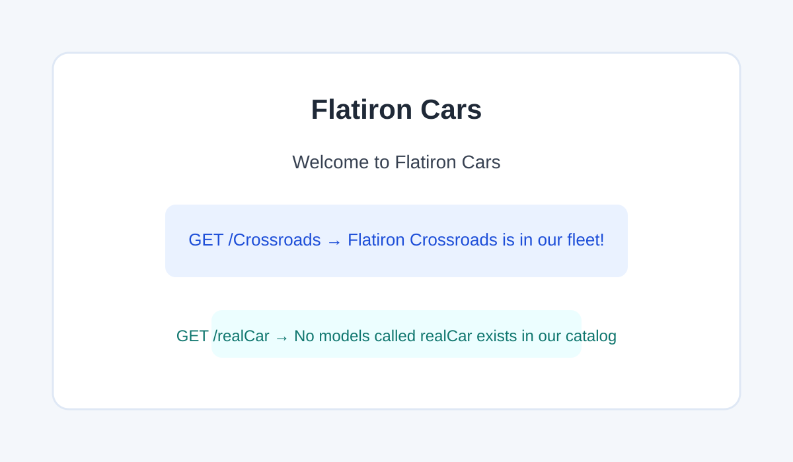

# Flatiron Cars Routes

A small Flask application for a car company homepage and model lookup routes.

## Overview

This project implements two user-facing routes:

- `/` returns the Flatiron Cars welcome message.
- `/<model>` checks a catalog of available car models and tells the user whether the requested model is in the fleet.

## Route Behavior

- `GET /` -> `Welcome to Flatiron Cars`
- `GET /Crossroads` -> `Flatiron Crossroads is in our fleet!`
- `GET /realCar` -> `No models called realCar exists in our catalog`

## Screenshot

## Local Setup

1. Install dependencies:
   `pipenv install`
2. Run the app:
   `pipenv run flask --app server.app run`
3. Visit the routes in your browser:
   - `http://127.0.0.1:5000/`
   - `http://127.0.0.1:5000/Crossroads`

## Project Structure

- `server/app.py` contains the Flask application and route logic.
- `server/testing/app_test.py` verifies the expected behavior.

## Best Practices Followed

- Added clear comments to explain route logic.
- Kept the application lightweight and easy to extend.
- Updated the README to reflect the real functionality.
- Removed unnecessary code and kept the project easy to maintain.

## Notes

The app uses an `existing_models` list and compares each URL parameter against that catalog. This makes it easy to add or remove fleet models later without changing the overall design.
